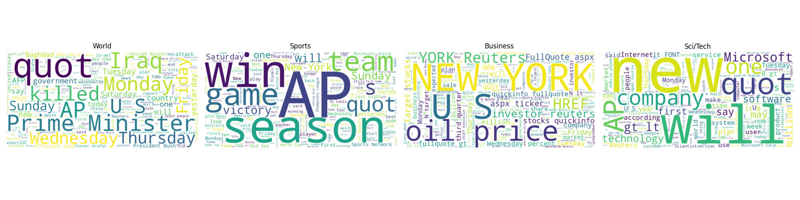
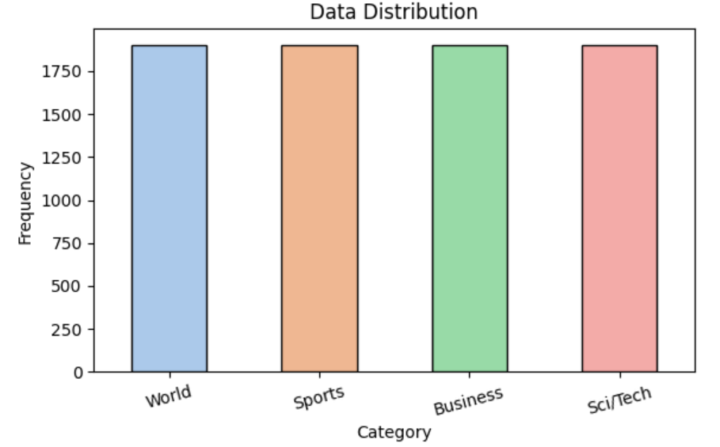
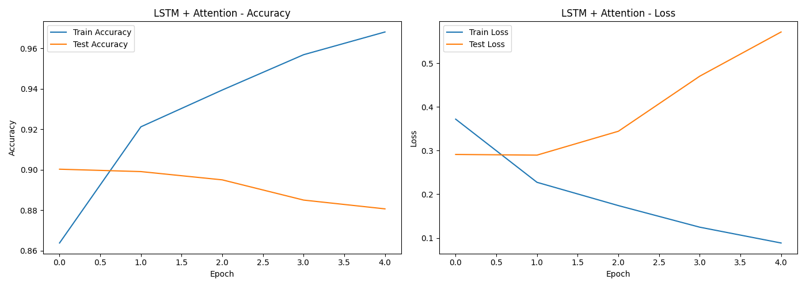
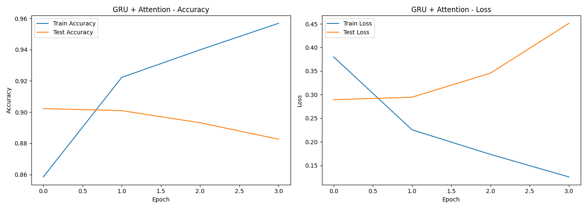
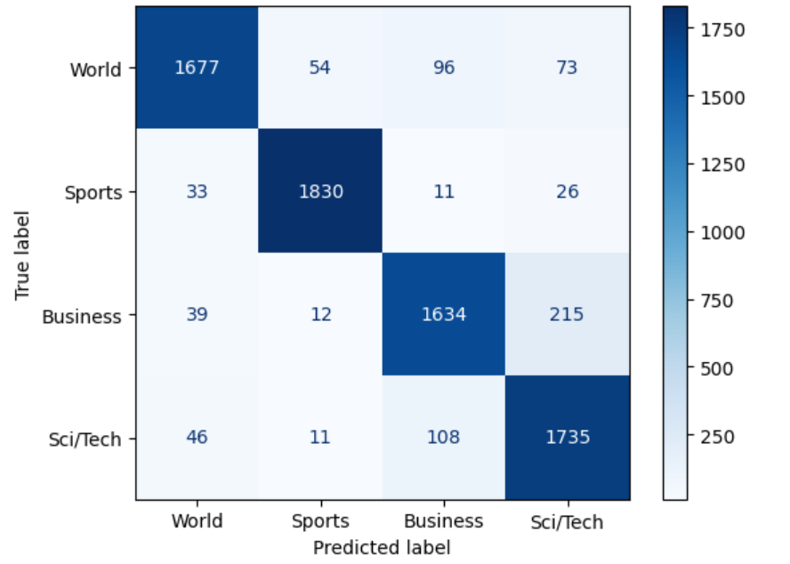
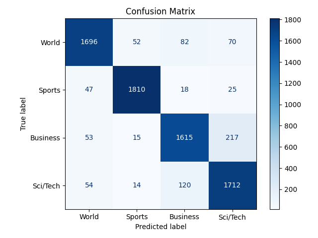

# A Hybrid Deep Learning Approach Using LSTM and GRU with Attention for News Categorization

This project demonstrates a full pipeline for text classification on the [AG News dataset](https://www.tensorflow.org/datasets/catalog/ag_news_subset) using TensorFlow. It includes preprocessing, visualization, and training two deep learning models: one with LSTM + Attention layer and another with GRU + Attention layer.

---

## Dataset

- **Source:** AG News Subset via `tensorflow_datasets`
- **Categories:** World, Sports, Business, Sci/Tech
- **Samples:** 120,000 training / 7,600 testing

**Word Cloud for original training data**

**Word Cloud for original test data**

---

## Preprocessing Pipeline

1. **Lowercasing**
2. **Removing punctuation/numbers**
3. **Stopword removal using NLTK**
4. **Tokenization using `TextVectorization`**
5. **One-hot encoding of labels**

   **Word Cloud for cleaned training data**

**Word Cloud for cleaned test data**

---

## Visualization
### Label Distribution: Frequency of each class

 **Label Distribution Plot for Training Dataset**
 

**Label Distribution Plot for Test Dataset**
 

---

##  Model Architectures

### LSTM with Attention Mechanism: Architecture

- Embedding layer
- Bidirectional LSTM
- Scaled Dot-Product Attention
- Global Average Pooling
- Dense softmax layer

### GRU with Attention Mechanism: Architecture

- Embedding layer
- Bidirectional GRU
- Scaled Dot-Product Attention
- Global Average Pooling
- Dense softmax layer

---

## Training Setup

- **Loss:** Categorical Crossentropy
- **Optimizer:** Adam
- **Metrics:** Accuracy
- **Epochs:** 10
- **Early Stopping:** Based on validation loss

---

## Results

### Accuracy & Loss Plots
**Confusion Matrix for LSTM with Attention Mechanism**

**Confusion Matrix for GRU with Attention Mechanism**

### Confusion Matrices
**Confusion Matrix for LSTM with Attention Mechanism**

The confusion matrix below summarizes the classification performance of the LSTM model enhanced with an attention mechanism on the AG News dataset. The model achieves strong overall performance, particularly on the *Sports* and *World* categories.

####  Classification Metrics

| Class       | Precision | Recall | F1-score |
|-------------|-----------|--------|----------|
| **World**   | 0.934     | 0.883  | 0.908    |
| **Sports**  | 0.960     | 0.963  | 0.961    |
| **Business**| 0.884     | 0.860  | 0.872    |
| **Sci/Tech**| 0.847     | 0.913  | 0.879    |
| **Macro Avg** | **0.906** | **0.905** | **0.905** |
| **Accuracy** |  |  | **90.5%** |

The LSTM-Attention model demonstrates high precision and recall across most classes, with particularly notable performance on *Sports* (F1 = 0.961). The model shows minor confusion between *Business* and *Sci/Tech*, which is common due to thematic overlap in news content.

The integration of an attention mechanism into the LSTM architecture improves the model’s focus on key information within sequences. This leads to better contextual understanding and higher classification performance, making it well-suited for news topic categorization tasks where nuanced semantic distinctions are important.

**Confusion Matrix for GRU with Attention Mechanism**

The GRU model enhanced with an attention mechanism achieved strong performance in classifying the AG News dataset across four categories: *World*, *Sports*, *Business*, and *Sci/Tech*. Below are the key performance metrics:

#### Classification Metrics

| Class       | Precision | Recall | F1-score |
|-------------|-----------|--------|----------|
| **World**   | 0.917     | 0.892  | 0.904    |
| **Sports**  | 0.957     | 0.953  | 0.955    |
| **Business**| 0.880     | 0.850  | 0.865    |
| **Sci/Tech**| 0.846     | 0.901  | 0.873    |
| **Macro Avg** | **0.900** | **0.899** | **0.899** |
| **Accuracy** |  |  | **89.9%** |

The overall accuracy of the model was **89.9%**, indicating effective learning of class-specific patterns. The model demonstrated exceptional performance on the *Sports* category and maintained balanced results across the remaining classes. Some minor misclassification was observed between the *Business* and *Sci/Tech* classes, suggesting potential semantic overlap.

The integration of an attention mechanism with GRU significantly enhanced the model’s ability to focus on important tokens within sequences, resulting in improved classification performance. This architecture is well-suited for news categorization tasks where contextual understanding is essential.

---

## Model Files

- `lstm_attention_model.keras`, `lstm_attention.weights.h5`
- `gru_attention_model.keras`, `gru_attention.weights.h5`

---

